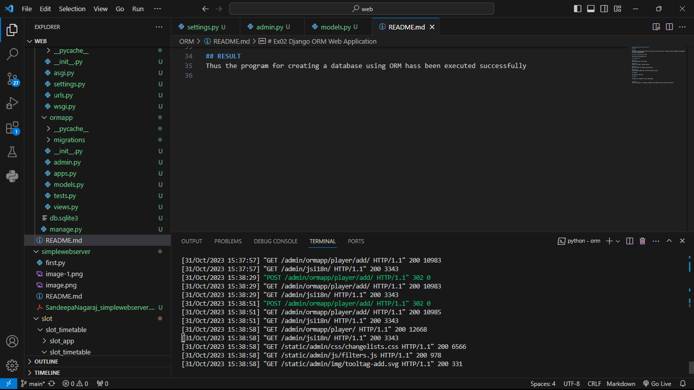

# Ex02 Django ORM Web Application
## Date: 

## AIM
To develop a Django application to store and retrieve data from a Football Players database using Object Relational Mapping(ORM).

## Entity Relationship Diagram

Include your ER diagram here

## DESIGN STEPS

### STEP 1:
Clone the problem from GitHub

### STEP 2:
Create a new app in Django project

### STEP 3:
Enter the code for admin.py and models.py

### STEP 4:
Execute Django admin and create 10 Football players

## PROGRAM
Admin.py
```py
from django.contrib import admin
from .models import Product

admin.site.register(Product)
```
models.py
```py
from django.db import models

class Product(models.Model):
    id = models.AutoField(primary_key=True)
    name = models.CharField(max_length=100)
    description = models.TextField()
    price = models.DecimalField(max_digits=10, decimal_places=2)
    quantity = models.IntegerField()
    created_at = models.DateTimeField(auto_now_add=True)
```
views.py
```py
from django.shortcuts import render
from .models import Product

def product_list(request):
    products = Product.objects.all()
    return render(request, 'product_list.html', {'products': products})

```

## OUTPUT



Include the screenshot of your admin page.


## RESULT
Thus the program for creating a database using ORM hass been executed successfully
